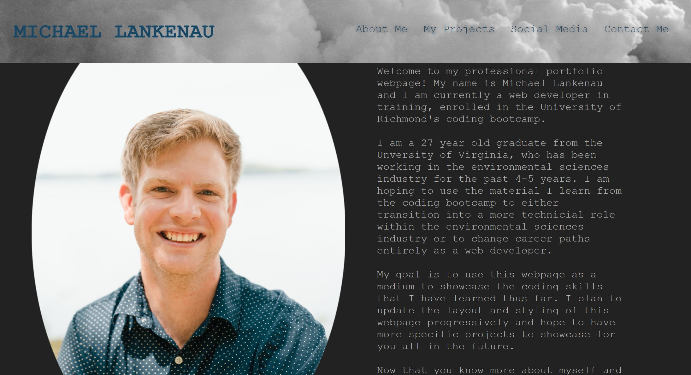

# My Professional Portfolio

## Background
For one of our coding bootcamp's challenge assignments, we were tasked with creating our own professional portfolio completely from scratch!  The portfolio is designed to be updated as I learn new coding skills, as well as updated with links to new separate projects.

## Live Product

See the live URL of the deployed application here: https://mtlankenau.github.io/professional-portfolio/